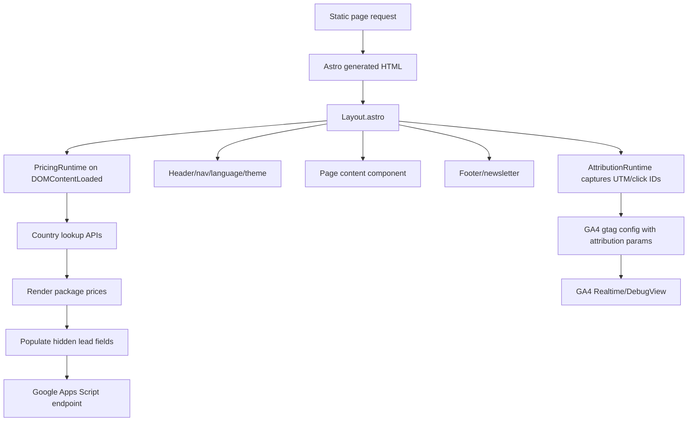
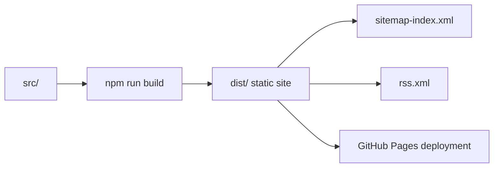

# Architecture

Read this before modifying the application. The site is a static Astro application with client-side runtimes for attribution, GA4, pricing detection, forms, newsletter, theme, and navigation.

## Repository Structure

```text
.
├── astro.config.mjs
├── package.json
├── public/
│   ├── assets/
│   ├── robots.txt
│   ├── llms.txt
│   └── icons/manifests
├── scripts/
│   ├── deploy.sh
│   └── test-pricing.mjs
├── src/
│   ├── components/
│   ├── config/
│   ├── content/
│   ├── layouts/
│   ├── pages/
│   └── styles/
└── docs/
```

## Frameworks And Dependencies

- Astro `^5.17.2`
- `@astrojs/sitemap`
- No frontend framework dependency.
- No test framework dependency beyond Node's built-in `node:test`.
- No lint script currently exists.

## Build System

Scripts in `package.json`:

- `npm run dev`: starts Astro dev server.
- `npm run build`: generates static output in `dist/`.
- `npm run test:pricing`: runs build, then `node scripts/test-pricing.mjs`.
- `npm run deploy:hostpoint`: runs the legacy Hostpoint SFTP deployment script.

## Routing

Routes are static and generated by Astro.

- `/` redirects to `/en/` while preserving query string and hash.
- `/:locale/` is the localized homepage.
- `/:locale/:page/` handles `services-pricing`, `portfolio`, `blog`, `about`, `contact`.
- `/:locale/services/:service/` renders generated service SEO pages from `src/content/services.ts`.
- `/:locale/industries/:industry/` renders generated industry SEO pages from `src/content/industries.ts`.
- Legacy localized pages `services`, `packages`, `demos`, and `example-projects` redirect to current routes while preserving UTM query parameters.
- `/:locale/blog/:slug/` renders localized blog articles.
- `/:locale/demos/:demo/` supports demo routes.
- `/:locale/example-projects/:project/` supports illustrative analysis pages.
- `/rss.xml` returns English blog RSS.
- `/privacy/` and `/impressum/` are static legal pages.

## Localization Architecture

Core file: `src/content/locales.ts`.

- `localeCodes` is the canonical language list.
- `getLocaleContent(locale)` returns JSON content from `src/content/locales/*.json`.
- `getLocalizedPath(locale, page)` resolves localized home/page paths and legacy redirects.
- `getAlternates(page)` creates hreflang alternate definitions.

Localized page copy lives in JSON files. Demo, example-project, and blog content use TypeScript registries with localized overrides.

## Component Architecture

Global layout:

- `src/layouts/Layout.astro`
  - Adds metadata, canonical, hreflang, OG/Twitter tags.
  - Adds structured data.
  - Initializes attribution before GA.
  - Defines `window.trackWebsiteliEvent`.
  - Renders `Header`, page slot, `Footer`, and `PricingRuntime`.

Major components:

- `Header.astro`: desktop/mobile nav, language switcher, theme toggle, tracked header CTAs.
- `Footer.astro`: footer links, WhatsApp, newsletter form.
- `LocalizedHero.astro`: homepage hero.
- `PageSections.astro`: services/pricing, portfolio, blog, about, contact page bodies.
- `CTASection.astro`: lead/contact form and submit runtime.
- `PricingRuntime.astro`: country/currency/pricing detection and price rendering.
- `AttributionRuntime.astro`: UTM/click-id capture and storage.
- `ArticleCTA.astro`: reusable blog article conversion CTA.
- `ArticleShare.astro`: compact social share/copy-link component.

## Data Flow



## Blog Architecture

Core files: `src/content/blog/index.ts`, `src/content/blog/types.ts`, and `src/content/blog/posts/{slug}.ts`.

- `BlogPost` type includes slug, title, description, category, tags, image, author, dates, reading time, audience, excerpt, headings parsed from body Markdown, related links, optional FAQs, locale metadata, and body content.
- Each blog post is one TypeScript source file in `src/content/blog/posts/{slug}.ts`.
- Each post file contains all languages in a `translations` object.
- `getBlogPosts(locale)` resolves the requested locale from each post's `translations`.
- `getBlogPost(locale, slug)` resolves the requested post and locale.
- Blog index content is localized in `getBlogIndexContent(locale)`.
- Article route `src/pages/[locale]/blog/[slug]/index.astro` renders metadata, BlogPosting/Breadcrumb/FAQ schema, article body, CTAs, sharing, and related links.

Important rule: one file per post. Add translations inside that post file rather than creating per-locale folders.

## Forms

Lead form:

- Component: `src/components/CTASection.astro`.
- Posts JSON payload with `mode: no-cors` to Google Apps Script endpoint.
- Includes honeypot field, privacy consent, pricing metadata, attribution metadata, source page, demo/project context, and user agent.
- Emits `contact_form_start` and `contact_form_submit`.

Newsletter:

- Component: `src/components/Footer.astro`.
- Posts JSON payload to the same Google Apps Script endpoint.
- Includes honeypot, privacy consent, attribution, country/currency/market, page URL, referrer, and user agent.
- Emits `newsletter_subscribe`.

## Analytics And Attribution

GA4 ID: `G-TGZY875FGJ`.

Attribution:

- `AttributionRuntime.astro` stores first-touch and last-touch campaign data in `localStorage` key `websiteli_attribution`.
- Redirect context uses `sessionStorage` key `websiteli_redirect_context`.
- Supported UTM keys: `utm_source`, `utm_medium`, `utm_campaign`, `utm_term`, `utm_content`, `utm_id`.
- Supported click IDs include `gclid`, `gbraid`, `wbraid`, `fbclid`, `msclkid`, `ttclid`, `li_fat_id`.

GA config:

- `Layout.astro` calls `gtag('config', 'G-TGZY875FGJ', gtagConfig)`.
- Explicit `page_view` events are intentionally not sent separately.
- Home language paths are normalized to GA `page_path="/"` while preserving full query in `page_location`.

## Pricing

Source of truth:

- `src/config/pricing.json`: price values, markets, currencies.
- `src/config/pricing.ts`: stable package keys, package-name mapping, EU country list, market fallback logic.
- `src/config/packageLabels.ts`: localized package labels.

Runtime:

- `PricingRuntime.astro` checks deployment country metadata first, then lookup APIs (`country.is`, `ipapi.co`, `geojs.io`, `ipinfo.io`, Cloudflare trace).
- First priced result wins; otherwise fallback country or `DEFAULT`.
- Prices are rendered into `[data-package-price]` and `[data-package-card]` for priced packages.
- Hidden form fields are updated via `window.websiteliUpdateInquiryFields`.
- `digitalAudit` is an unpriced contact-form package option used by audit CTAs.

## Third-Party Integrations

- Google Analytics 4 via `gtag.js`.
- Google Apps Script form endpoint for leads/newsletter.
- Country lookup APIs for pricing.
- GitHub Pages deployment via GitHub Actions.
- Legacy Hostpoint SFTP deployment via `lftp`.
- `@astrojs/sitemap` for sitemap generation.

## Environment Variables

The GitHub Pages workflow does not require hosting secrets. The legacy Hostpoint deployment script requires:

- `HOSTPOINT_HOST`
- `HOSTPOINT_USERNAME`
- `HOSTPOINT_PASSWORD`
- `HOSTPOINT_TARGET_PATH`

Optional `.env` is loaded by `scripts/deploy.sh`.

## Generated Outputs



## Important Architectural Decisions

- Static Astro pages are preferred for performance and SEO.
- Client-side JS is used only where runtime browser state is necessary: attribution, GA, pricing detection, forms, theme, nav.
- Query strings must be preserved through redirects for attribution.
- Canonicals should stay clean; analytics `page_location` may include query strings.
- New features should extend existing components and content registries instead of replacing them.
